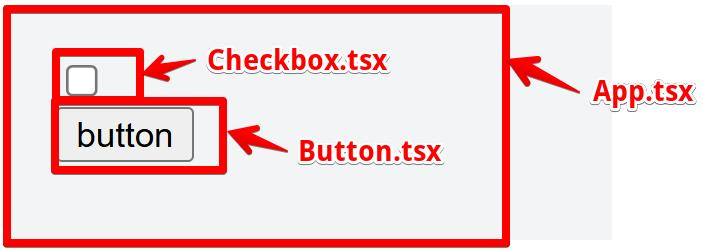
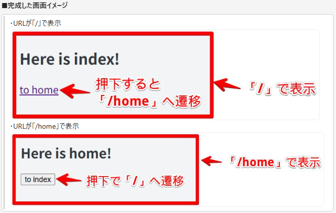
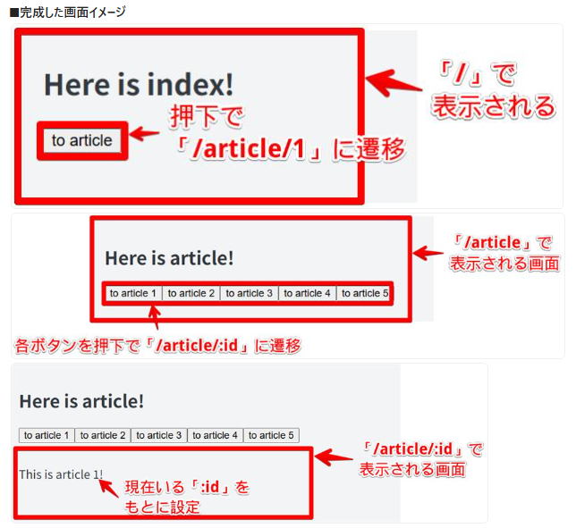
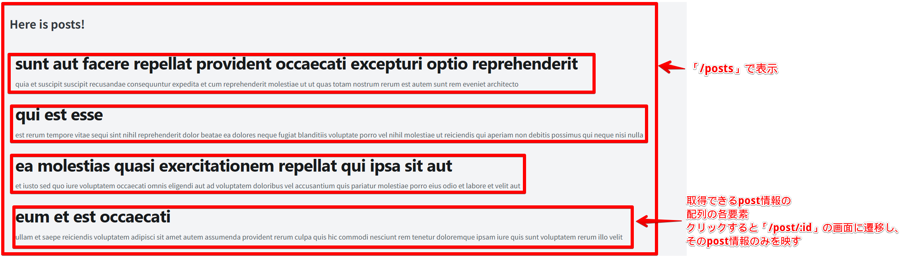

# 準備

### 1．WSLをインストールし、Ubuntuを立ち上げる(WSL Install and Update)

①Windows10用WSL(Windows Subsystem for Linux)をインストールするために、管理者権限でPowerShellを立ち上げ、次のコマンドを実行する
〈WSL2、Ubuntu（Linuxディストリビューション）のインストール〉

```bash
wsl --install
```

②インストール後、再起動してUbuntuを立ち上げる
〈Ubuntu立ち上げ〉

```bash
wsl.exe -d Ubuntu  #今後Ubuntuを呼び出すときは毎度実行するコマンド
```

③任意のユーザ名とパスワードを設定する

```bash
sudo useradd -m hoge  #hogeは作成したいユーザ名
sudo passwd hoge  #先ほど作成したユーザのパスワードを設定(hogeはユーザ名)
```

参照：https://learn.microsoft.com/ja-jp/windows/wsl/install#manual-installation-steps
参考：[【2025年版】WindowsでWSLをインストールする方法｜コマンド一発＆超簡単！](https://www.choge-blog.com/programming/windowsinstallwsl/)

④Ubuntuのパッケージアップデートのため、次のコマンドを実行する
〈Ubuntuの細心のパッケージ情報を取得〉

```bash
sudo apt update  #パッケージ一覧の更新
sudo apt upgrade  #パッケージ更新
```

〈Ubuntuのパッケージを更新〉

```bash
sudo apt-get dist-upgrade
```

※「Temporary failure…」というエラーが出た場合、/etc/resolv.confにDNSサーバを指定する
参照：https://qiita.com/ryosukeYamazaki/items/c04ec3ff78aac6eb8d26

### 2．npm、reactをインストールし、プロジェクトを作成・起動する

①npmをインストールする

```bash
sudo apt install npm
```

②reactをインストールする
参照：https://qiita.com/NaoyaOgura/items/cb94fefb6a63b7965f15
→「インストール手順」まで

③プロジェクトの作成・起動をする

```bash
sudo apt install nodejs -y  #バージョンを上げておかないとviteの作成ができない
node -v  #バージョンが20以上か確認
yarn create vite hogehoge --template react-ts  #hogehogeは作成したいプロジェクト名
cd /mnt/c/…/hogehoge  #作成したプロジェクトに移動
tsc --init  #カレントディレクトリにtsconfig.json（TypeScriptコンパイラの設定）ファイルを作成
yarn  #プロジェクトにyarn形成
yarn dev  #開発用に実行（Ctrl-cで解除）
yarn build && yarn start  #本番用に実行（next build → yarn start）でも可能
```

### 3．Visual Studio Codeで開く

```bash
code .  #コマンド入力した場所のファイルが開かれる
```

# React理解

### 1．SPAに関して

[今さら聞けないSPA（シングルページアプリケーション）とは](https://qiita.com/shinkai_/items/79e539b614ac52e48ca4)

ex）PC(=`Backbone.js`)、スマホ(=`React`)
→どちらもSPA(Single Page Application)

- MPA(Multi Page Application)との違い
  - **HTMLの生成**→MPA:サーバ側 SPA:クライアント側(初回読み込み時等を除く)
  - **情報の更新**→MPA:ページ遷移 SPA:コンテンツのみ更新

### 2．package.json / node_modulesについて

[そろそろ適当に npm install するのを卒業する](https://qiita.com/sugurutakahashi12345/items/3cc49926faeaf25d3051)

Webアプリケーションを開発する際、外部パッケージを多く用いる
`package.json`(パッケージを管理するファイル)についての理解
※Reactもパッケージの1種

### 3．ビルドについて

[React がビルドされるまでの流れを理解したい](https://zenn.dev/aidemy/articles/355aff43e45c34)

SPAのアプリケーションを実行する際は、`HTML/JS`ファイルをアプリケーションからクライアントに送付する
「`HTML/JS`ファイル」の実装内容を反映させられるように、ビルドツールによって以下を行う

- TypeScript→JavaScriptへのトランスパイル(コンパイル)
- `minify`(圧縮)
- 外部パッケージの解決 など

### 4．named exportとdefault exportについて

[named exportとdefault exportの違いを理解する](https://zenn.dev/yuji6523/articles/373a675275abc4)

- named export(名前付きエクスポート)とは
  - 1つのモジュール内に複数exportできる
  - 呼び出し側では、export時の名前でimportする必要
    →import {test} from './sample' ：〇
    import {testes} from './sample' ：×
  - エディタの自動補完が効く
- default export(デフォルトエクスポート)とは
  - 1つのモジュール内に1つだけexportできる
    →ファイルの責務を強制的に1つに絞れる
  - 呼び出し側で名前を自由に定義できる
    →import test from './sample' ：〇
    import testes from './sample' ：〇
  - エディタの自動補完が効きずらい

### 5．import React from 'react';について

[Next.jsでReactをimportするのとしないのって何か変わるの？](https://zenn.dev/ivry/articles/d1972dd9dd8748)

- *import {useState} from "react";*のとき
  `useState`をそのまま呼び出せる
- *import React from "react";*のとき
  `useState`を`React.useState`として呼び出せる
  →例）

```tsx
const [state, setState] = React.useState(初期値);
```

※`state`：現在の状態の値(の取得)(stateという名前でなくても可)
`setState`：状態を変更するための関数(setStateという名前でなくても可)
`初期値`：最初に入れておく値(文字列、数値、配列、オブジェクトなどなんでも可)

### 6．通常関数とアロー関数

[JavaScript: 通常の関数とアロー関数の違いは書き方だけではない。異なる性質が10個ほどある。](https://qiita.com/suin/items/a44825d253d023e31e4d)

- 「巻き上げ」の違い
  基本的にファイルは上から下に読み込まれるが、`function`を用いて定義した場合、ファイルの下で定義した関数をファイルの上で参照可能
  →関数の定義位置がばらばらになるなど問題あり？

[【JavaScript】1分で理解する！=>アロー関数の基本](https://it-biz.online/web-design/arrow-function/)

- 初めてアロー関数に触れる人にオススメな一品
- アロー関数の書き方が即わかる

[【ぼくのJavaScript備忘録】アロー関数 の使い方徹底解説](https://qiita.com/tgw-3a/items/012363b7df2964254914)

- アロー関数での`this`の扱い方などが知れる
- 上の書き方を理解した後に読んでみると〇

### 7．`react-router`と`react-router-dom`について

[react-router-dom](https://www.npmjs.com/package/react-router-dom)

`react-router-dom`は `react-router@v7`で吸収されているので、 `react-router-dom`を `package.json`の `dependencies`から削除し、 `react-router`の最新版をinstallする
※古いパッケージを使っている場合は別かも…

### 8．Reactでルーティング、画面遷移

[Reactでルーティングの実装](https://hebiblog.org/react-router-dom/)

[Reactで画面遷移を行う](https://hebiblog.org/react-navigate/)

- 2記事ともわかりやすく説明されていて理解しやすい
- Routerコンポーネントを使用しよう！

### 9．React RouterによるURLパラメータ取得

[React Router urlパラメータ 取得 & 型指定（TypeScript）](https://qiita.com/nakamo-03/items/0d76a016c445868c5b09)

- 今回はこちらの記事の少し下の方の「useParamsを使用して取得する\*（React v16.8以上）」を参照して実装している

### 10．Outletとchildren

実装練習3のように、あるURL (/article) の共通レイアウト部分と、ネストしたURL (/:id) のレイアウト部分を共存させる場合、 `<Outlet />`を用いる

- 私の書き方だと、ネストする部分を`children`として書いている
  →共通レイアウト(親)部分の`<Outlet />`の場所にネストされた`children`(子)が入って表示される

### 11．JavaScriptの「??」「||」「&&」

[JavaScriptの「??」「||」「&&」を擦れるくらい使いこなす](https://lorem-co-ltd.com/sumbol-if/)

- `??``||``&&`の演算子を用いることでnullやundifinedが入り込むのを防ぐ

### 12．useLocation

[ReactのuseLocationとは？](https://qiita.com/Hashimoto-Noriaki/items/a64c7990c905db4281e0)

- useLocationの事例も見つつ学べる

```tsx
const location = useLocation();
const maxQuizLen = location.state.maxQuizLen;
```

→state.の後も忘れずに記述すべし

### 13．useEffect

[なんとなくでuseEffectを使うのをやめたい。](https://zenn.dev/shiro12/articles/09e4e8b26928d9)

- useEffectの使い方
  - 第二引数に空配列を渡す方法はベストプラクティスではない
  - ただし、mount時に1回行いたい処理がある場合は今でもよく使われる
  - 第二引数の配列内に変更を監視したい対象を入れていくのだが、できるなら useEffectではなくハンドラ関数(onClick~や handleClick~)で制御したい
  - ハンドラ関数でどうにかできない場合の応急処置だと思っておく

### 14．fetch関数

[【TypeScript】fetchの使い方を徹底解説！たった12のステップ](https://jp-seemore.com/web/13835/)

- fetchの基本が知れるのでオススメ

### 15．GitHubの新規リポジトリ作成方法

[新しいリポジトリの作成](https://docs.github.com/ja/repositories/creating-and-managing-repositories/creating-a-new-repository)

- 今回はPublicなリポジトリを作成
  →間違えてprivateで作成しても後ほど変更できる
- 名前などは任意

# VSCodeとGitHubの連携

### 1．準備

参照：React理解 15

- 体系的理解
  [Gitを使ったバージョン管理](https://backlog.com/ja/git-tutorial/intro/01/)
  > 「作業スペースの内容をリポジトリに反映する(push)」「リポジトリの内容を作業スペースに反映する(pull)」作業をすることで、作業ごとの差分の同期ができる
- GitHub上にPublicなリポジトリを作成
  →共有する際はブラウザを開いた際のURLでよいが、マージ等行う予定がある場合は招待を行う
- ローカルの内容をリポジトリへ連携
  [【初心者向け】GithubとローカルPCとの連携](https://qiita.com/tariki-code/items/1c1d720bf389d1c47d85)
  > 「`git clone`」→リポジトリ上に既存のコードがあって、自分の作業場所にリポジトリのコードを持ってきたい場合

> 「`git remote add <リポジトリのURL>`」→自分の作業場所にリポジトリに反映したいコードがある場合 -「`Git Graph`」拡張機能をインストールすると、現在のGitのブランチの状態を視覚的に確認できる

### 2．ブランチ作成、push、PR(Pull Request)の作成

- developブランチを作成
  ※課題に番号が振られていれば、それを使用した名前のブランチを作成
- 作業内容(ローカル)を`develop`ブランチで`push`し、PR(Pull Request)を作成する
  →PRはレビュワーに連携、確認完了次第マージされる
- `main`ブランチを`pull`する(マージされた内容をローカルに取り込む)

> PR・MR(Merge Request)では、`description`の部分に「(もしあれば)課題番号」、「このブランチでは何を実装したか」、「(もしあれば)どんな分からない部分があるか」などを記述する

> PR・MR(Merge Request)では、レビュワーや指摘対応者を指定する
> →画面右の「`Reviewers`」と「`Assignees`」を設定すれば良い
> [コラボレーターを個人リポジトリに招待する](https://docs.github.com/ja/enterprise-cloud@latest/account-and-profile/how-tos/setting-up-and-managing-your-personal-account-on-github/managing-access-to-your-personal-repositories/inviting-collaborators-to-a-personal-repository#inviting-a-collaborator-to-a-personal-repository)

### 3．不要ファイルをPRから除外

- `package.json`と同階層に`.gitignore`ファイルを作成
  →除外対象のファイル名を記載
  ※今回は`package-lock.json`と`node_modules`ディレクトリを記載する

> 1度gitにアップしている場合はキャッシュを削除する必要がある
> [.gitignoreに記載したのに反映されない件](https://qiita.com/fuwamaki/items/3ed021163e50beab7154)

> [[Git] .gitignoreの仕様詳解](https://qiita.com/anqooqie/items/110957797b3d5280c44f)

### 4．コミットの修正

[git rebase についてまとめてみた](https://qiita.com/KTakata/items/d33185fc0457c08654a5)

> `git rebase(各種オプション)`にて過去のコミットに手を加えることができる

> 同じコメントで表せるような作業(修正作業のまた修正など)の場合は、新たにコミットを打つのではなく編集して見直す

### 5．PRマージ後、ローカルでの作業

最新のリモートリポジトリの内容をローカルリポジトリに反映

```bash
$ git fetch -p
```

mainブランチの最新化

```bash
$ git checkout main
$ git pull --rebase
# $ git pull -rでも良い

# developブランチの最新化(次に作業をする際は、最新のmainブランチの先頭からdevelopブランチを生やす)
$ git checkout develop
# 新しくブランチを作る場合は
# $ git checkout -b <作業ブランチ>
$ git rebase main
```

> マージ後不要になったブランチについて、リモートリポジトリ上は削除されるがローカルリポジトリ上は自動的に削除されない
> →`git branch -D <不要になったブランチ名>`で適宜削除する

※コミット前の差分を一時退避させたいとき

```bash
$ git stash -u
```

### 6．issue対応

> 1issueにつき1ブランチ(`feature/<issueのID>`)

> コミットメッセージの書式は「`feature/<issueのID> <メッセージ本文(実装内容のサマリ)>`」

> issue対応が完了しPRを作成する際は、「`closes #<対応したissueのID>`」のコメントをつける
> ※マージされた際に当該`issue`が自動で`close`される

### 7．他ブランチの取り込み

```bash
$ git cherry-pick <取り込みたいコミットID>
```

> <取り込みたいコミットID>のコミットが現在のブランチの先頭に追加される

> コミットIDはGitGraph上や`git log`コマンドで確認する

### コードの品質均一化に向けた拡張機能① Prettierの導入

①VSCodeに拡張機能`Prettier - Code formatter`をインストール
②`/.vscode`ディレクトリを作成し、`settings.json`を作成
※現場では現場のルールを確認して決める

```json
{
  "editor.defaultFormatter": "esbenp.prettier-vscode",
  "editor.formatOnSave": true,
  "editor.codeActionsOnSave": {
    "source.fixAll.eslint": "explicit"
  },
  "[typescript]": {
    "editor.useTabStops": true,
    "editor.tabSize": 2,
    "editor.insertSpaces": true
  },
  "[typescriptreact]": {
    "editor.useTabStops": true,
    "editor.tabSize": 2,
    "editor.insertSpaces": true
  },
  "[html]": {
    "editor.useTabStops": true,
    "editor.tabSize": 2,
    "editor.insertSpaces": true
  },
  "[css]": {
    "editor.useTabStops": true,
    "editor.tabSize": 2,
    "editor.insertSpaces": true
  }
}
```

③ターミナルで`$ npm i -D prettier@latest`を実施
④`/package.json`を編集

```json
  "scripts": {
    "dev": "npm run build && vite",
    "build": "npm run format && npm run lint && npm run type-check && vite build",
    "format": "prettier --write .",
    "lint": "eslint .",
    "type-check": "tsc -b",
    "preview": "vite preview"
  },
```

⑤`/.prettierrc`ファイルを作成し、以下のように記述

```
{
  "singleQuote": false,
  "jsxSingleQuote": true,
  "useTabs": false,
  "tabWidth": 2,
  "semi": true,
  "bracketSpacing": true,
  "trailingComma": "none",
  "printWidth": 120
}
```

> アプリの実行やビルド時に、ずれているファイルを自動的に整形できるようになる

> VSCodeでも保存時に自動整形してくれる機能がある
> [Visual Studio Codeで保存時自動整形の設定方法](https://qiita.com/mitashun/items/e2f118a9ca7b96b97840)

### コードの品質均一化に向けた拡張機能② ESLintの導入

①VSCodeの拡張機能の`ESLint`をインストール
②`./package.json`の`scripts.lint`を編集

```json
"lint": "eslint . --report-unused-disable-directives --max-warnings 0 --fix"
```

③任意のファイルでエラーが発生している際、`npm run lint`でエラーが発生し、`npm run build`や`npm run dev`が途中で止まることを確認する

> PR提出やビルド前にエラーを検知可能になる

# Gitポイントまとめ

### 作業前

> 基準となるブランチが細心化されているかを確認する
> 基準となるブランチに移り、`git fetch -p`→`git pull --r`を行うとローカルリポジトリの基準ブランチの内容が、細心のリモートリポジトリの基準ブランチの内容に上書きされる
> その後、`git checkout -b <作業ブランチ>`を実行する
> ※古いままの基準ブランチだと、デグレの可能性あり

> ブランチのIDを確認する
> Redmine(タスク管理ツール)を使用する場合、Redmine上でチケットを起票し、そのチケットIDをもとにブランチ名が決定される
> →GitHub上ではissueを作成してそのIDでブランチ名を決めていく

ex）#2のissueであれば、対応ブランチ名は`feature/2`

### 作業中/後

> 基準となるブランチの状態を確認する
> PR・MRを提出する前に、基準ブランチの状態をもう一度確認する
> →作業ブランチが遅れている場合、`rebase`を通じて最新の基準ブランチから作業ブランチを生やすように修正する
> ※`conflict`もこの時に解消

> PR・MRには対応内容を必ず記載する
> PRの`description`に「今回の作業ブランチで何を実装したか」をできるだけ詳細に記載
> →Redmineでも、対応内容やレビュワーの設定、レビュワーへの質問事項などを記載

# 実装練習

### 1．componentとpropsの関係

参照：React理解 4,5,6

①`App.tsx`内に`checkbox/button`を作成し、`checkbox`が`checked`な状態なら`button`が非活性化(`disabled`)になるように実装
②①の内容をファイル分割して実装
※以下の3ファイルを作成

- `App.tsx`
- `Checkbox.tsx`
- `Button.tsx`



### 2.react-routerの使用

参照：React理解 2,7,8

①`react-router`パッケージをインストール(`package.json dependencies`に追加)
②「`/`」にて押下すると「`/home`」へ遷移するURLを記載
③「`/home`」にて押下すると「`/`」へ遷移するボタンを実装
→ボタンについては再利用性の高い`component`を意識



> `useNavigate`フックを用いてページ遷移(ルーティング)を行う

> `Button.tsx`について、情報を渡して使用する形に定義すると再利用性が高くなる

> →先に定義して定義されたものを使用する

### 3.ネストしているURLの実装

参照：React理解 9,10

①「`/`」にて押下すると「`/article`」へ遷移するボタンを実装
②「`/article`」にて「`/article/:id`」へ遷移するボタンを1～5まで実装
③「`/article/:id`」では、「`/article`」の画面下部に「This is article :id！」と表示される



> あるURL (`/article`) の共通レイアウト部分と、ネストしたURL (`/:id`) のレイアウト部分を共存させる場合、` <Outlet />`を用いる

> `<Route />`の設定も調整する必要がある

> URLパラメータの取得には、`useParams`フックを用いる

### 4.画面間での情報引継ぎ

参照：React理解 11,12

①「`/`」にて押下すると「`/article`」へ遷移するボタンを実装
②「`/article`」にて「`/article/:id`」へ遷移するボタンを実装
③「`/article/:id`」では、「`/article`」の画面下部に「This is article :id！」と遷移元(前の画面)の「`/article/:id`」が「`from:id`」として表示される
→「`/`」から遷移してきた場合などは「`from:id`」が表示されない


> `useLocation`フックを用いると、画面間で引き継ぐ情報(`state`)や現在のURL(`pathname`)を取得できる

> `??``||``&&`の演算子を用いることで、`null`や`undefined`が入り込むことを防げる

### 5.API経由のデータ取得

参照：React理解 13,14

①「https://jsonplaceholder.typicode.com/posts」にリクエストを送り、post情報の配列を取得
②「`/posts`」にて取得したpost情報のタイトルを羅列表示、クリックすると「`/post/:id`」に遷移し、対応するpost情報(body)をタイトル下に表示する



> `fetch`関数を用いて取得する

> `useState`を用いて保持・表示する

> `post`においても型定義を行い、`any`型は使わない
> →予想外のデータが来た時にエラーに気付きづらくなるため
> ※`interface`と`type`はほぼ同じ機能

### 6.データフェッチの方法を@tanstack/react-queryに変更

- `@tanstack/react-query`をインストール

```bash
npm install @tanstack/react-query
```

### 7.単体テストの実装(これ以外のすべてが終わってから取り掛かった方が良い)

> **原則**
>
> - `test`の説明(第一引数)は、「～であること」のように期待値の内容を記述する
> - `test`のコールバック(第二引数)内の`export`は1つ
>   →1ケース当たり1つの期待値
> - モックの返り値指定や`render`関数の実行など、同じ処理を複数テストケースで実行する場合は、`describe`配下に複数`test`をまとめ、`beforeEach`を用いる

# その他備考

### 1．`e`に関して

`e.target.value` …イベント(e)が起こった際に入力された値を取得する
`onChange=(e)=>{setValue(e.target.value)}` …入力値をstateに保存
`onClick=(e)=>{console.log(e.target.value)}` …ボタンや選択肢の値を確認
`e.target.checked` …チェックボックスのON/OFF状態を取得

### 2．配列の再定義

ex）

```tsx
{
  /*state.inputnameに入力値をセット*/
}
onInput = (e) => {
  this.setState({
    inputname: e.target.value,
  });
};
{
  /*this.stateからnames(配列)とinputname(入力値)の要素を取得*/
}
const { names, inputname } = this.state;
```

`names: [...names, inputname]` …元の`names`配列を展開し、最後に`inputname`を追加した新たな`names`配列を作成

※Reactでは、`names.push`など元の配列に対して直接触れる(=破壊的操作)のは**NG**

### 3．配列で履歴を作る

ex）

```tsx
this.setState((prevState) => ({
  names: [...prevState.names, prevState.inputname],
  namesHistory: [...prevState.namesHistory, [...prevState.names]],
  inputname: "",
}));
```

→履歴を作成したいなら、元の配列を入れてある配列（2重配列になってる）に新しい`names`配列を格納すれば良い

### 4．slice()

`array.slice(start, end)`
→配列の`start`から`end`の1つ前までを取得
`array`：配列名
`start`：開始インデックス(数字)(含む)
`end`：終了インデックス(数字)(含まない)
※`end`を省略した場合、配列の末尾まで取得される

ex）

```tsx
names: [...names.slice(0, index), ...names.slice(index + 1)];
```

→`index`番目の要素を削除した新しい配列を作成する

### 5．React.FCとは

Reactの関数コンポーネントだということをTypeScriptに伝える書き方
`React.FC<--Props>`でPropsの型指定可能
※--は指定したいPropsの名前

### 6．アロー関数まとめ

・関数宣言

```tsx
function test() {
  document.write("Hello World");
}
```

→呼び出し：`test()`

・関数式…関数を間接的に呼び出し

```tsx
const test = function () {
  document.write("Hello World");
};
```

→呼び出し：`test()`

・アロー関数…関数式の`function`が場所を変えて=>になったと考える

```tsx
const test = () => {
  document.write("Hello World");
};
```

→呼び出し：`test()`

ex）

```tsx
let sample2 = (a, b) => {
  document.write(a + b);
};
```

→呼び出し：`sample2(2,3)`

※引数が1つの場合…`()`の省略が可能
※引数がない場合…上記の通り`()`が必要

```tsx
const testes = n => n*2;　←return省略
＝const double = n => { return n * 2 };
```

←`{}`があれば`return`をかく

※複数の文を処理する場合、`{}`を使用し、`return`を明示的に記述する必要あり

※オブジェクトを返す時、`{}`は`return`が必要だが、`()`だと`return`省略可能
ex）省略前

```tsx
const getUser = () => {
  return { name: "太郎", age: 25 };
};
```

→呼び出し：`getUser()`;

ex）省略後

```tsx
const getUser = () => ({ name: "太郎", age: 25 });
```

→呼び出し：`getUser()`;

※`=`のあとが関数の時かつ`TSX`か`JSX`のときは`{}`で囲む必要あり

```tsx
onChange={(e) => onChange(e.target.checked)}
{/*ダメな例
onChange = e => onChange(e.target.checked)*/}
```

→`onChange`に文字列を渡しているように見える
→`=`の右に`{}`がないから`JS`の式として解釈されない
→`e=>onChange(e.target.checked)`が`JS`でなく、ただの値として扱われる

### 7．.tsxのreturn内でfor文？

`Array.from` …tsxのreturn内でfor文の代わりに使用できる、配列を作りながら中身の生成ができるもの
`Array.from({ length: N }, (要素, インデックス) => 処理)`

ex）

```tsx
Array.from({ length: 3 }, (_, i) => i); // [0, 1, 2]
```

※上記`(_, i) => (i)`の部分
`_` …値は使わないという意味の慣習、配列の中身が空なので不要など
`i` …インデックス

### 8．typeについて

```tsx
type Person = {
  name: string;
  age: number;
};
```

があったとする。これは

```tsx
type Person={
	name:string:"太郎";
	age:number:20;
};
```

とはできない。もししたいなら

```tsx
type Person = {
  name: string;
  age: number;
  isStudent: boolean;
};

let person: Person = {
  name: "Taro",
  age: 20,
  isStudent: false,
};
```

→このような感じで別で初期化する必要がある

※`JavaScript`では

```js
let person = {
  name: "Taro",
  age: 20,
};
```

こうして定義するが、これは型指定しないから
→`TypeScript`は`JavaScript`から派生した言語のため、`TypeScript`特有の`type`定義は上と一緒に定義するとはじかれる

※プロパティの追加の違い①
`JavaScript`は例えば上の`person`なら

```js
person.city = "東京都";
```

とプロパティを追加できるが、
`TypeScript`の場合、

```tsx
type person = {
  name: string;
  age: number;
};
```

と書いてある{}内に追加しないといけない

※プロパティの追加の違い②
`TypeScript`でも

```tsx
type Person = {
  name: string;
  age: number;
  [key: string]: any;
};
```

このように書けばどんなプロパティでも後々追加可能になるが、安全性が下がるから**絶対に**やめるべき
`JavaScript`でも

```js
person.city = "東京都";
person.hobbies = ["読書", "旅行"];
```

→こういったものも追加できるが、**絶対に**やめておくべき

### 9．State、useLocationについて

```tsx
const [selectedId, setSelectedId] = useState<number | null>(null);
```

`selectedId` …現在の状態（選択されたID）を表す変数、`useState`から取り出す
`setSelectedId` …状態を更新するための関数
→`selectedId`を変更したいときに使用する
`useState<型>(初期値)` …Reactに「この状態はこの型で初期値はこれ」と伝える関数
→上記だと`state`が`number`か`null`になる、初期値は`null`（まだ選ばれていない）、何かを選んだ時に`setSelectedId(3)`のように変更される

### 10．interfaceとtypeの違い

- interface

```tsx
interface Person {
  name: string;
  age: number;
  greet(): void;
}
```

- type

```tsx
type Person = {
  name: string;
  age: number;
  greet(): void;
};
```

※似てる…

①再定義

- interface

```tsx
interface Person {
  name: string;
}
interface Person {
  age: number;
}
// OK: 自動的に { name: string; age: number } になる
const p: Person = { name: "John", age: 25 };
```

- type

```tsx
type Person = {
  name: string;
};
{
  /* エラー：重複定義できない
type Person = {
  age: number;
}*/
}
```

②ユニオン型・交差型

- interface
  …ユニオン型を直接定義できない

```tsx
{
  /* エラー
interface Status = "success" | "error";
*/
}
```

- type

```tsx
type A = { foo: string };
type B = { bar: number };
{
  /* ↓交差型で { foo: string; bar: number }*/
}
type C = A & B;
{
  /* ↓ユニオン型もOK*/
}
type Status = "success" | "error" | "loading";
```

③拡張性

- interface
  …拡張可能（`extends`、再宣言もOK）
- type
  …拡張も可能だが制限あり

④型としての柔軟性

- interface
  …オブジェクト型専用
- type
  …関数型、プリミティブ、タプルなどもOK

⑤主な用途

- interface
  …クラスの設計・継承
- type
  …より柔軟な型定義、ユニオン

### 11．fetch関数

`fetch` …webブラウザや`Node.js`などの環境で、外部リソースや`API`にアクセスするためのメソッド
→`Promise`ベースのインタフェースを持つため非同期処理としてデータを取得する
→ページをリロードせずにサーバからデータを取得したりデータを送信したりできる

ex）

```tsx
fetch("https://api.example.com/data")
  .then((response) => response.json())
  .then((data) => {
    console.log(data); // 取得したデータを表示
  })
  .catch((error) => {
    console.error("エラーが発生:", error);
  });
```

→指定した`URL`からデータ取得
※戻り値は`Promise`オブジェクト
※`Promise`オブジェクトは`Response`オブジェクトを解決値として持つ
→取得したデータを`JSON`形式と仮定して`response.json()`を使用し`JSON`として解析
→取得したデータをコンソールに表示、エラーがあれば`catch`が反応

ex）

```tsx
fetch('https://api.example.com/data')
  .then(response => {
    // ステータスコードが200番台でなければエラーとして処理
    if (!response.ok) {　←Promiseの解決値Responseを用いてチェック
      throw new Error('ネットワーク応答が不正です。');
    }
    return response.json();
  })
  .then(data => {
    console.log(data); // 取得したデータを表示
  })
  .catch(error => {
    console.error('エラーが発生:', error);
  });
```

- 基本的なAPI呼び出し

```tsx
// APIから取得するデータの型を定義
interface ApiResponse {
  userId: number;
  id: number;
  title: string;
  body: string;
}

// APIからデータを取得する関数
async function fetchData(): Promise<ApiResponse[]> {
  const response = await fetch("https://jsonplaceholder.typicode.com/posts");
  const data: ApiResponse[] = await response.json();
  return data;
}

// データ取得を実行
fetchData().then((data) => {
  console.log(data);
});
```

※`async` …非同期処理（`asynchronous`）を簡単に書くための構文
→`Promise`より見やすく、エラー処理も簡単にできる

```tsx
async function 〇〇(): Promise<型> {
  //処理
}
```

※`await` …`Promise`が解決されるまで待機して、結果を変数に代入する

※`API`からデータ取得する関数（アロー関数）

```tsx
const fetchData = async (): Promise<ApiResponse[]> => {
  //処理
};
```

※`.then` …「`Promise`が成功した時」（そのとき）に実行される関数を登録する

### 12．string型内にhtmlの\nなどが混ざっている場合

```tsx
<pre>{body}</pre>
```

など`<pre>`で囲んでおけばとりあえず大丈夫！

### 13．.gitignoreに記述するのはなぜ？

- `node_modules`ディレクトリと`package-lock.json`は`npm i`を実行した際に生成され、その中に外部パッケージの情報を格納していく
  →外部パッケージの情報は`package.json`に記載されているため、上記2フォルダ・ファイルをGitで管理する必要はない

### 14．ブランチ作成

①VScode上にブランチを作る
→左下の現在のブランチ名（`main`など）をクリックし、新しいブランチを作成
→もしくは、VScodeのターミナルに`git checkout -b <ブランチ名>`と入力

②新規ブランチをリモートにプッシュ
→プロジェクトがあるフォルダに移動する
`cd C:/Users/pbh1-hirayama/Documents/練習用/react2/sample_react1` のように
→`git push -u origin <ブランチ名>`　…GitHubに新規ブランチ名のブランチが作成される（コミットし、マージされたいときにも入力）
③いつも通りコミットプッシュマージをしていく

※最新のリモートリポジトリの内容をローカルリポジトリに反映
`git fetch -p`

※mainブランチの最新化
`git checkout main`
`git pull --rebase` …ローカルリポジトリの基準ブランチの内容が細心のリモートリポジトリの基準ブランチの内容に上書きされる

＊developブランチの最新化（次に作業する際は最新のmainブランチの先頭からdevelopブランチを生やす）
`git checkout develop(枝分かれブランチ)`
→`git checkout -b <作業ブランチ>` でも良い …現在ブランチから新規作業ブランチを作成し、同時にそのブランチに切り替える
`git rebase main`　…現在のブランチにmainブランチの最新の変更を取込む

※いらなくなったブランチは適宜削除する
`git branch -D <不要になったブランチ名>`

※コミットのコメントを変更する方法

```bash
git config --global core.editor "code --wait"
```

…rebase時のエディタをVScodeに設定
`git rebase -i HEAD^` …「`^`」の数だけ前のコミットを変更対象に含められる
→「`pick abc1234 Your original commit message`」みたいに出てくる
(pickはメッセージの確認みたいなものでそのまま使われる)
→「`reword`」を設定することでコミット内容を変更せずにコミットメッセージのみ変更となる（上記pickをrewordに変更）
→`reword pick abc1234 Your original commit message`

※直前のコミットだけを直したいなら

```bash
git commit --amend`
```

※複数コミットにrewordを使う時

```bash
git rebase -i HEAD~3
```

→「`reword abc1234 first commit`
`reword def5678 second commit`
`reword ghi9012 third commit`」のように指定数（今回なら3つ）出てくるすべてを「`reword`」に書き換える
→メッセージ編集画面が指定数出てくる（各コミットは独立して残る）

※複数コミットをまとめたい場合
ex）3つコミットがあるとする

```bash
git rebase -i HEAD~3
```

→pick a111111 初期実装
pick b222222 コメント追加
pick c333333 タイポ修正

1．`squash`（統合、メッセージは変更）の場合
pick a111111 初期実装
_squash_ b222222 コメント追加
_squash_ c333333 タイポ修正　　とする
→メッセージ編集文が出てくるためそれに従い、メッセージを変更する
→変更メッセージと共にコミットされた1つのコミットとして保存される

2．`fixup`（統合、メッセージも統合）の場合
pick a111111 初期実装
_fixup_ b222222 コメント追加
_fixup_ c333333 タイポ修正
→何も聞かれず3つが1つにまとまり、メッセージは「初期実装」だけが残る
