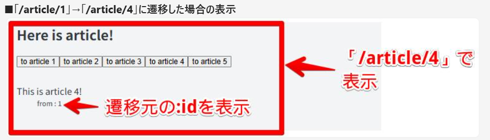

# 準備

### 1．WSLをインストールし、Ubuntuを立ち上げる(WSL Install and Update)

①Windows10用WSL(Windows Subsystem for Linux)をインストールするために、管理者権限でPowerShellを立ち上げ、次のコマンドを実行する
〈WSL2、Ubuntu（Linuxディストリビューション）のインストール〉

```bash
wsl --install
```

②インストール後、再起動してUbuntuを立ち上げる
〈Ubuntu立ち上げ〉

```bash
wsl.exe -d Ubuntu  #今後Ubuntuを呼び出すときは毎度実行するコマンド
```

③任意のユーザ名とパスワードを設定する

```bash
sudo useradd -m hoge  #hogeは作成したいユーザ名
sudo passwd hoge  #先ほど作成したユーザのパスワードを設定(hogeはユーザ名)
```

参照：https://learn.microsoft.com/ja-jp/windows/wsl/install#manual-installation-steps

④Ubuntuのパッケージアップデートのため、次のコマンドを実行する
〈Ubuntuの細心のパッケージ情報を取得〉

```bash
sudo apt update  #パッケージ一覧の更新
sudo apt upgrade  #パッケージ更新
```

〈Ubuntuのパッケージを更新〉

```bash
sudo apt-get dist-upgrade
```

※「Temporary failure…」というエラーが出た場合、/etc/resolv.confにDNSサーバを指定する
参照：https://qiita.com/ryosukeYamazaki/items/c04ec3ff78aac6eb8d26

### 2．npm、reactをインストールし、プロジェクトを作成・起動する

①npmをインストールする

```bash
sudo apt install npm
```

②reactをインストールする
参照：https://qiita.com/NaoyaOgura/items/cb94fefb6a63b7965f15
→「インストール手順」まで

③プロジェクトの作成・起動をする

```bash
sudo apt install nodejs -y  #バージョンを上げておかないとviteの作成ができない
node -v  #バージョンが20以上か確認
yarn create vite hogehoge --template react-ts  #hogehogeは作成したいプロジェクト名
cd /mnt/c/…/hogehoge  #作成したプロジェクトに移動
tsc --init  #カレントディレクトリにtsconfig.json（TypeScriptコンパイラの設定）ファイルを作成
yarn  #プロジェクトにyarn形成
yarn dev  #開発用に実行（Ctrl-cで解除）
yarn build && yarn start  #本番用に実行（next build → yarn start）でも可能
```

### 3．Visual Studio Codeで開く

```bash
code .  #コマンド入力した場所のファイルが開かれる
```

# React理解

### 1．SPAに関して

[今さら聞けないSPA（シングルページアプリケーション）とは](https://qiita.com/shinkai_/items/79e539b614ac52e48ca4)

ex）PC(=`Backbone.js`)、スマホ(=`React`)
→どちらもSPA(Single Page Application)

- MPA(Multi Page Application)との違い
  - **HTMLの生成**→MPA:サーバ側 SPA:クライアント側(初回読み込み時等を除く)
  - **情報の更新**→MPA:ページ遷移 SPA:コンテンツのみ更新

### 2．package.json / node_modulesについて

[そろそろ適当に npm install するのを卒業する](https://qiita.com/sugurutakahashi12345/items/3cc49926faeaf25d3051)

Webアプリケーションを開発する際、外部パッケージを多く用いる
`package.json`(パッケージを管理するファイル)についての理解
※Reactもパッケージの1種

### 3．ビルドについて

[React がビルドされるまでの流れを理解したい](https://zenn.dev/aidemy/articles/355aff43e45c34)

SPAのアプリケーションを実行する際は、`HTML/JS`ファイルをアプリケーションからクライアントに送付する
「`HTML/JS`ファイル」の実装内容を反映させられるように、ビルドツールによって以下を行う

- TypeScript→JavaScriptへのトランスパイル(コンパイル)
- `minify`(圧縮)
- 外部パッケージの解決 など

### 4．named exportとdefault exportについて

[named exportとdefault exportの違いを理解する](https://zenn.dev/yuji6523/articles/373a675275abc4)

- named export(名前付きエクスポート)とは
  - 1つのモジュール内に複数exportできる
  - 呼び出し側では、export時の名前でimportする必要
    →import {test} from './sample' ：〇
    import {testes} from './sample' ：×
  - エディタの自動補完が効く
- default export(デフォルトエクスポート)とは
  - 1つのモジュール内に1つだけexportできる
    →ファイルの責務を強制的に1つに絞れる
  - 呼び出し側で名前を自由に定義できる
    →import test from './sample' ：〇
    import testes from './sample' ：〇
  - エディタの自動補完が効きずらい

### 5．import React from 'react';について

[Next.jsでReactをimportするのとしないのって何か変わるの？](https://zenn.dev/ivry/articles/d1972dd9dd8748)

- *import {useState} from "react";*のとき
  `useState`をそのまま呼び出せる
- *import React from "react";*のとき
  `useState`を`React.useState`として呼び出せる
  →例）

```tsx
const [state, setState] = React.useState(初期値);
```

※`state`：現在の状態の値(の取得)(stateという名前でなくても可)
`setState`：状態を変更するための関数(setStateという名前でなくても可)
`初期値`：最初に入れておく値(文字列、数値、配列、オブジェクトなどなんでも可)

### 6．通常関数とアロー関数

[JavaScript: 通常の関数とアロー関数の違いは書き方だけではない。異なる性質が10個ほどある。](https://qiita.com/suin/items/a44825d253d023e31e4d)

- 「巻き上げ」の違い
  基本的にファイルは上から下に読み込まれるが、`function`を用いて定義した場合、ファイルの下で定義した関数をファイルの上で参照可能
  →関数の定義位置がばらばらになるなど問題あり？

[【JavaScript】1分で理解する！=>アロー関数の基本](https://it-biz.online/web-design/arrow-function/)

- 初めてアロー関数に触れる人にオススメな一品
- アロー関数の書き方が即わかる

[【ぼくのJavaScript備忘録】アロー関数 の使い方徹底解説](https://qiita.com/tgw-3a/items/012363b7df2964254914)

- アロー関数での`this`の扱い方などが知れる
- 上の書き方を理解した後に読んでみると〇

### 7．`react-router`と`react-router-dom`について

[react-router-dom](https://www.npmjs.com/package/react-router-dom)

`react-router-dom`は `react-router@v7`で吸収されているので、 `react-router-dom`を `package.json`の `dependencies`から削除し、 `react-router`の最新版をinstallする
※古いパッケージを使っている場合は別かも…

### 8．Reactでルーティング、画面遷移

[Reactでルーティングの実装](https://hebiblog.org/react-router-dom/)

[Reactで画面遷移を行う](https://hebiblog.org/react-navigate/)

- 2記事ともわかりやすく説明されていて理解しやすい
- Routerコンポーネントを使用しよう！

### 9．React RouterによるURLパラメータ取得

[React Router urlパラメータ 取得 & 型指定（TypeScript）](https://qiita.com/nakamo-03/items/0d76a016c445868c5b09)

- 今回はこちらの記事の少し下の方の「useParamsを使用して取得する\*（React v16.8以上）」を参照して実装している

### 10．Outletとchildren

実装練習3のように、あるURL (/article) の共通レイアウト部分と、ネストしたURL (/:id) のレイアウト部分を共存させる場合、 `<Outlet />`を用いる

- 私の書き方だと、ネストする部分を`children`として書いている
  →共通レイアウト(親)部分の`<Outlet />`の場所にネストされた`children`(子)が入って表示される

### 11．JavaScriptの「??」「||」「&&」

[JavaScriptの「??」「||」「&&」を擦れるくらい使いこなす](https://lorem-co-ltd.com/sumbol-if/)

- `??``||``&&`の演算子を用いることでnullやundifinedが入り込むのを防ぐ

### 12．useLocation

[ReactのuseLocationとは？](https://qiita.com/Hashimoto-Noriaki/items/a64c7990c905db4281e0)

- useLocationの事例も見つつ学べる

```tsx
const location = useLocation();
const maxQuizLen = location.state.maxQuizLen;
```

→state.の後も忘れずに記述すべし

### 13．useEffect

[なんとなくでuseEffectを使うのをやめたい。](https://zenn.dev/shiro12/articles/09e4e8b26928d9)

- useEffectの使い方
  - 第二引数に空配列を渡す方法はベストプラクティスではない
  - ただし、mount時に1回行いたい処理がある場合は今でもよく使われる
  - 第二引数の配列内に変更を監視したい対象を入れていくのだが、できるなら useEffectではなくハンドラ関数(onClick~や handleClick~)で制御したい
  - ハンドラ関数でどうにかできない場合の応急処置だと思っておく

### 14．fetch関数

[【TypeScript】fetchの使い方を徹底解説！たった12のステップ](https://jp-seemore.com/web/13835/)

- fetchの基本が知れるのでオススメ

# VSCodeとGitHubの連携

# 実装練習

### 1．componentとpropsの関係

参照：React理解 4,5,6

①`App.tsx`内に`checkbox/button`を作成し、`checkbox`が`checked`な状態なら`button`が非活性化(`disabled`)になるように実装
②①の内容をファイル分割して実装
※以下の3ファイルを作成

- `App.tsx`
- `Checkbox.tsx`
- `Button.tsx`


### 2.react-routerの使用

参照：React理解 2,7,8

①`react-router`パッケージをインストール(`package.json dependencies`に追加)
②「`/`」にて押下すると「`/home`」へ遷移するURLを記載
③「`/home`」にて押下すると「`/`」へ遷移するボタンを実装
→ボタンについては再利用性の高い`component`を意識


> `useNavigate`フックを用いてページ遷移(ルーティング)を行う

> `Button.tsx`について、情報を渡して使用する形に定義すると再利用性が高くなる

> →先に定義して定義されたものを使用する

### 3.ネストしているURLの実装

参照：React理解 9,10

①「`/`」にて押下すると「`/article`」へ遷移するボタンを実装
②「`/article`」にて「`/article/:id`」へ遷移するボタンを1～5まで実装
③「`/article/:id`」では、「`/article`」の画面下部に「This is article :id！」と表示される


> あるURL (`/article`) の共通レイアウト部分と、ネストしたURL (`/:id`) のレイアウト部分を共存させる場合、` <Outlet />`を用いる

> `<Route />`の設定も調整する必要がある

> URLパラメータの取得には、`useParams`フックを用いる

### 4.画面間での情報引継ぎ

参照：React理解 11,12

①「`/`」にて押下すると「`/article`」へ遷移するボタンを実装
②「`/article`」にて「`/article/:id`」へ遷移するボタンを実装
③「`/article/:id`」では、「`/article`」の画面下部に「This is article :id！」と遷移元(前の画面)の「`/article/:id`」が「`from:id`」として表示される
→「`/`」から遷移してきた場合などは「`from:id`」が表示されない



> `useLocation`フックを用いると、画面間で引き継ぐ情報(`state`)や現在のURL(`pathname`)を取得できる

> `??``||``&&`の演算子を用いることで、`null`や`undefined`が入り込むことを防げる

### 5.API経由のデータ取得

参照：React理解 13,14

①「https://jsonplaceholder.typicode.com/posts」にリクエストを送り、post情報の配列を取得
②「`/posts`」にて取得したpost情報のタイトルを羅列表示、クリックすると「`/post/:id`」に遷移し、対応するpost情報(body)をタイトル下に表示する


> `fetch`関数を用いて取得する

> `useState`を用いて保持・表示する

> `post`においても型定義を行い、`any`型は使わない
> →予想外のデータが来た時にエラーに気付きづらくなるため
> ※interfaceとtypeはほぼ同じ機能

### 6.データフェッチの方法を@tanstack/react-queryに変更

- @tanstack/react-queryをインストール

```bash
npm install @tanstack/react-query
```

### 7.単体テストの実装(これ以外のすべてが終わってから取り掛かった方が良い)

> **原則**
>
> - `test`の説明(第一引数)は、「～であること」のように期待値の内容を記述する
> - `test`のコールバック(第二引数)内の`export`は1つ
>   →1ケース当たり1つの期待値
> - モックの返り値指定や`render`関数の実行など、同じ処理を複数テストケースで実行する場合は、`describe`配下に複数`test`をまとめ、`beforeEach`を用いる

# その他備考

### 1．`e`に関して

`e.target.value` …イベント(e)が起こった際に入力された値を取得する
`onChange=(e)=>{setValue(e.target.value)}` …入力値をstateに保存
`onClick=(e)=>{console.log(e.target.value)}` …ボタンや選択肢の値を確認
`e.target.checked` …チェックボックスのON/OFF状態を取得

### 2．配列の再定義

ex）

```tsx
{
  /*state.inputnameに入力値をセット*/
}
onInput = (e) => {
  this.setState({
    inputname: e.target.value
  });
};
{
  /*this.stateからnames(配列)とinputname(入力値)の要素を取得*/
}
const { names, inputname } = this.state;
```

`names: [...names, inputname]` …元のnames配列を展開し、最後にinputnameを追加した新たなnames配列を作成

※Reactでは、names.pushなど元の配列に対して直接触れる(=破壊的操作)のはNG

### 3．配列で履歴を作る

ex）

```tsx
this.setState((prevState) => ({
  names: [...prevState.names, prevState.inputname],
  namesHistory: [...prevState.namesHistory, [...prevState.names]],
  inputname: ""
}));
```

→履歴を作成したいなら、元の配列を入れてある配列（2重配列になってる）に新しいnames配列を格納すれば良い
